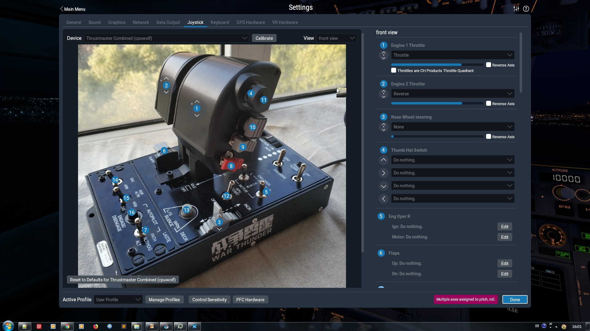

# TARGETWarthog

a script for Thrustmaster T.A.R.G.E.T script editor

highly customize Hotas Warthog dual throttle for X-Plane 11 HotStart TBM-900 aircraft

## prerequisite ##

1. web page https://support.thrustmaster.com/zh/product/hotas-warthog-dual-throttles-zh/
    Download software T.A.R.G.E.T - Software v3.0.18.328 v2, we will need TARGET Script Editor later. and don't forget to install it
1. X-Plane 11

## make shortcut of Windows ##

"C:\Program Files (x86)\Thrustmaster\TARGET\x64\TARGETGUI.exe" -r hotstart_tbm900_reverse.tmc

## maintainence website ##

https://forums.x-plane.org/index.php?/files/file/48249-warthog-throttle-deep-customization-for-tbm-900-win/

Chinese version videos

https://space.bilibili.com/76970085/#/

https://www.youtube.com/user/cpuwolf/

## Screenshot on X-Plane 11 ##

## AirFoilLabs King Air 350 Demo ##

https://www.youtube.com/watch?v=4TU3JEj20GU

## AFL King Air 350 joystick settings ##

